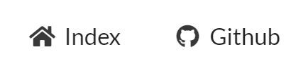
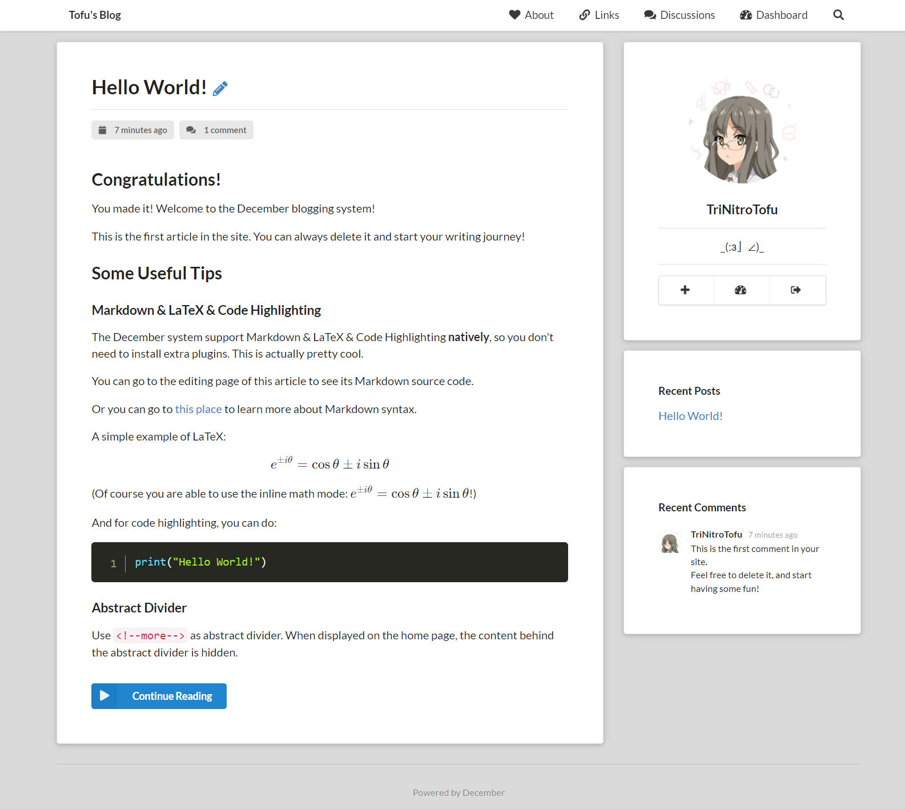
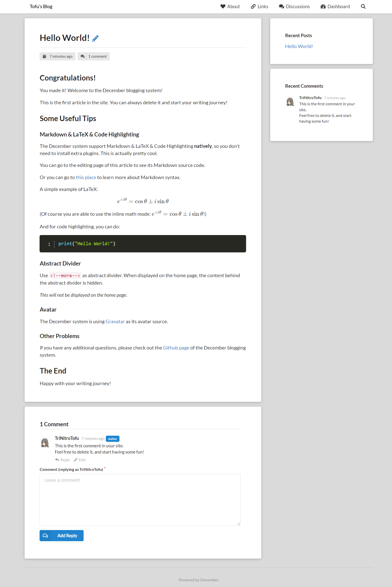
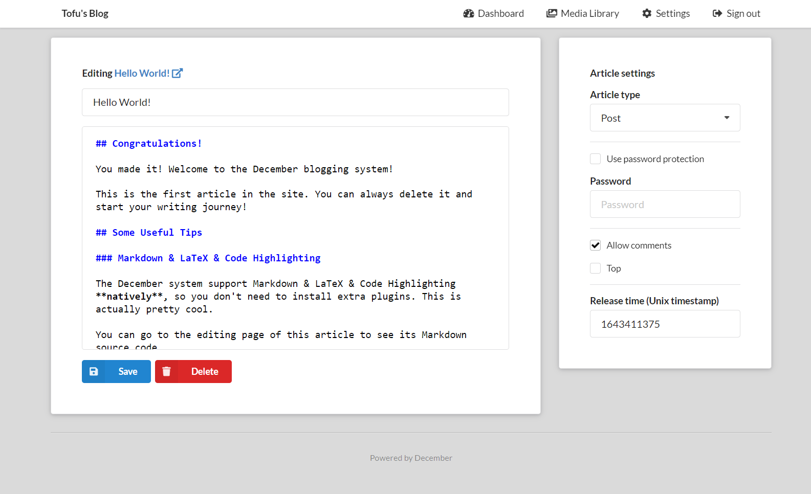
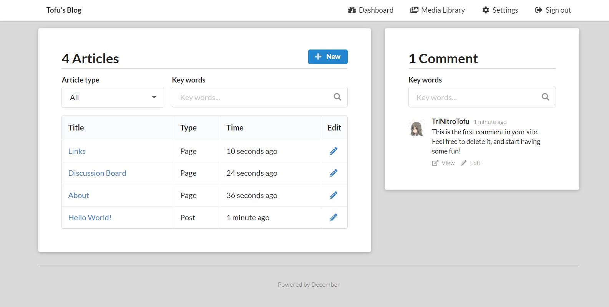
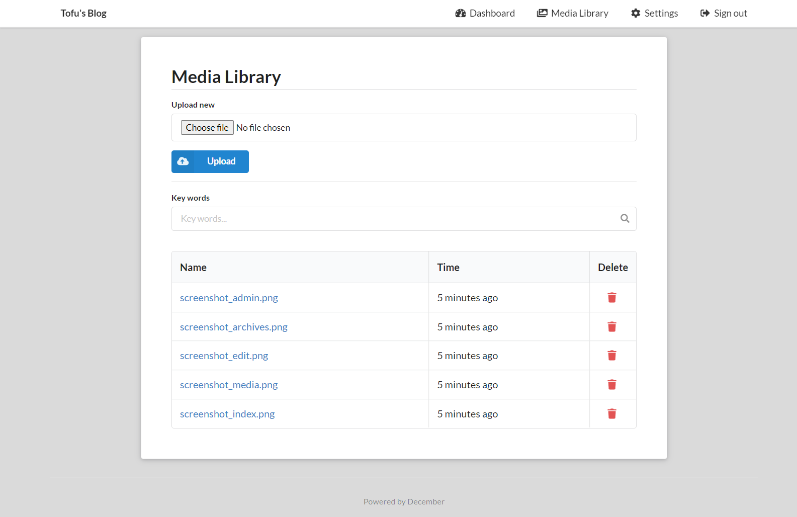
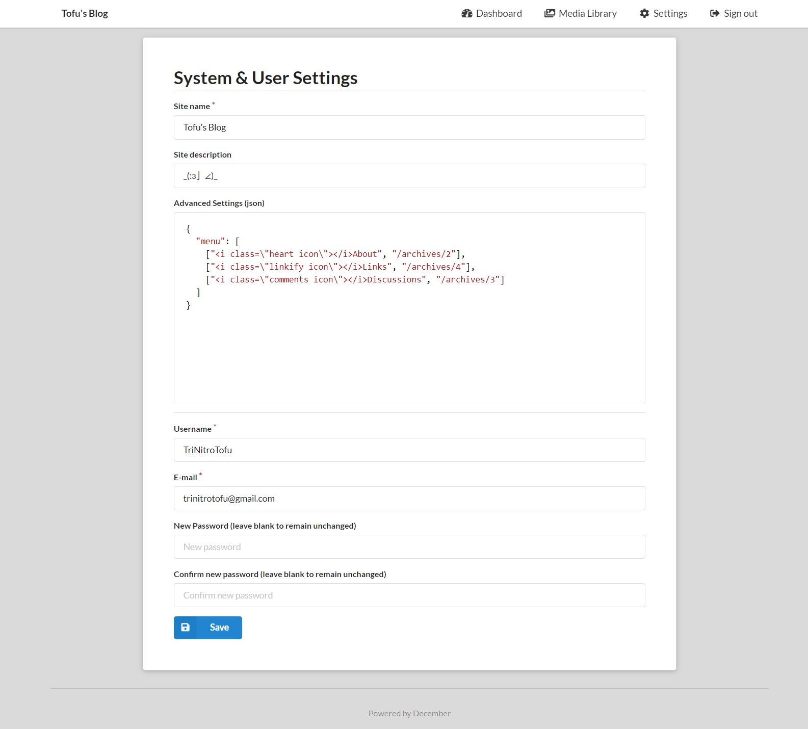

# December


Welcome to the December blogging system's code repository!

## Introduction

December is a minimalist personal blogging system that natively supports Markdown, LaTeX, and code highlighting.

This project is based on Python(Django), HTML, SQLite and JavaScript(jQuery).

Demo: [https://tofu.icu/](https://tofu.icu/)

### Main Features

+ Native support for Markdown parsing
+ Native support for LaTeX parsing (rendering by [KaTeX](https://katex.org/))
+ Native support for code highlighting (rendering by [PrismJS](https://prismjs.com/))
+ Aesthetically pleasing minimalist and responsive front-end design style (based on [Semantic UI](https://semantic-ui.com/))
+ Acticle rendering and edit system
+ Article comment and reply system
+ Media library system
+ Search system for articles (support article content search), comments and media files
+ Simple and friendly operation logic design
+ Password protection feature for articles
+ Pinned (top) post feature
+ Flexible and customizable advanced settings (in JSON)
+ SMTP mail notification system
+ Support for hCaptcha captcha, anti-spam comments and anti-brute-force password cracking

## Installation

There are two ways to install.

### Install via Docker Image (strongly suggested)

First, install Docker Engine on your machine: [Docker official guides](https://docs.docker.com/get-docker/).

For example, if you are using Ubuntu Server, run:

```shell
apt update
apt install docker-ce docker-ce-cli containerd.io
```

Then, use `docker run hello-world` to verify the installation.

After the Docker Engine has been successfully installed, install and start a December system container using the following command:

```shell
docker run --name december-blog --restart unless-stopped -p 8080:80 -d trinitrotofu/december
```

Then, visit `address_of_your_machine:8080`. You should now be able to see the system installation page.

**Some Tips:**

+ If you want to use another port, please replace "8080" in the command with the port number you want to use.
+ If you want to persist the data (mount the volume), you can use this command instead (assuming that the working directory of the blog system is `/www-data/December`):

```shell
docker run --name december-blog --restart unless-stopped \
        -v /www-data/December/db:/December/December/db \
        -v /www-data/December/configs:/December/December/configs \
        -v /www-data/December/media:/December/December/media \
        -p 8080:80 \
        -d trinitrotofu/december
```

Note:

+ `db` is the directory where your `db.sqlite3` is located.
+ You only need to mount `db`, `configs` and `media`, since your data is only stored in these three places.

### Install via Source Code

You can also download the source code directly and execute the following command (assuming your current working directory is the working directory of the blog system):

```shell
python3 manage.py runserver 0.0.0.0:8080
```

Please note that while this method can directly start an HTTP service that does not depend on other services, **this is inefficient and cannot handle static file requests**.

To handle static file requests, you still need to set up a static file service (using Nginx, for example), or use the following, **which is a very inefficient and potentially problematic security method**:

Open `settings.py` in the `December` folder of the working directory of the blog system, and change `DEBUG = False` to `DEBUG = True`. This will turn on the debug mode of the system. Again, be warned that debug mode may have serious security issues.

## Writing Articles

You can use various Markdown and LaTeX syntaxes to achieve all kinds of beautiful effects.

The system's Markdown rendering supports the display of HTML tags.

### Abstract Divider

Use `<!--more-->` as abstract divider.

When an article is displayed on the home page, the content behind the abstract divider will be hidden.

## Articles

### Post

This kind of articles will be presented on the homepage and in search results. Their contents are public, unless they are set to be password protected.

If a post is protected, the search engine will skip searching its content (but will still search its title), and the comments belong to it will not be shown as well.

They are open to comments, unless they are set to be not allowed for comments. If a post is not allowed for comments, comments belong to it will be hidden from visitors.

### Page

This kind of articles are similar with "Posts", but they will not be shown on the homepage and search page regardless of whether they are protected.

### Draft

Drafts are only visible to you, including their comments. And they will not be shown on the homepage and search page as well.

## Avatar

The December blogging system is using [Gravatar](http://gravatar.com/emails/) as its avatar source, including administrator's avatar and avatars in comments.

## Advanced Settings

Advanced settings is a very important and useful feature of the December blogging system.

You can find it in the settings page of the blog.

For this feature, you may need some basic knowledge about JSON.

**Warning: Incorrect advanced settings may cause the website to fail and become inaccessible. Please double check during configuration and use the JSON checker for verification.**

Format:

```json
{
  "key1": "Value1",
  "key2": "Value2",
  "key3": "Value3",
  "....": "......"
}
```

### Website Icon

+ Key: `icon`
+ Value: a string that represents the URL of the website icon. It can be either an internal relative address or an external URL.
+ Format: `"icon": "URL of the website icon"`
+ Example advanced settings:

```json
{
  "icon": "/static/img/icon_m.png"
}
```

### Navigation Menu

+ Key: `menu`
+ Value: an array that contains several tuples (subarrays in JSON), where every tuple represents an item in the navigation menu. Each tuple contains two strings, the first one represents the item's displaying value, and the second one represents the item's target URL.
+ Format: `"menu": [["name1", "url1"], ["name2", "url2"], ["name3", "url3"], ...]`
+ Example advanced settings:

```json
{
  "menu": [
    ["Index", "/"],
    ["Github", "https://github.com/"]
  ]
}
```

Since the displaying value can be HTML code, you can use **icon items** by adding HTML code of icons to it.

For example, the HTML code of "house" icon is `<i class="home icon"></i>`, and the HTML code of "Github" icon is `<i class="github icon"></i>`. You can add them into your advanced settings (note that the double quotes in strings need to be escaped as `\"`):

```json
{
  "menu": [
    ["<i class=\"home icon\"></i>Index", "/"],
    ["<i class=\"github icon\"></i>Github", "https://github.com/"]
  ]
}
```

Result of this example:



More icons: [https://semantic-ui.com/elements/icon.html](https://semantic-ui.com/elements/icon.html)

### Number of Posts to Display on Index / Search Page

+ Key: `post-number-per-page`
+ Value: an integer that represents the number of posts to display on every index / search page
+ Format: `"post-number-per-page": integer`
+ Example advanced settings:

```json
{
  "post-number-per-page": 8
}
```

If you do not set this value, then the default value will be used: 5 per page.

### Comment Prohibited Words

Due to increasingly rampant spam comments, hCaptcha cannot stop all of them for us. This advanced setting can let you set some customized prohibited words by using [regex (python)](https://docs.python.org/3/library/re.html).

+ Key: `comment-re`
+ Value: a list of string, contains the rules(regex) that you do not want to see in comments
+ Format: `"comment-re": ["regex1", "regex2", ..., "regexn"]`
+ Example advanced settings:

```json
"comment-re": [
  "I am a bot",
  "Test [0-9]+\\.[0-9]+"
]
```

In this example, the following comments will be banned due to the first rule:

+ `I am a bot`
+ `i AM a bOt`
+ `Hi, I am a bot.`

The following comments will be banned due to the second rule:

+ `test 1.0`
+ `test 1.2.3`
+ `This is TEST 3.0.`

These comments will NOT be banned:

+ `I am bot.`
+ `This is test 1.`

Note:

+ The system is using `re.search` method, so a comment will be banned as long as it "contains" one of the rules
+ The rule matching is case-insensitive

### hCaptcha

The system natively support [hCaptcha](https://www.hcaptcha.com/), to protect you from spam comments and password cracking.

hCaptcha is turned off by default, unless you set this advanced setting.

+ Key: `hcaptcha`
+ Value: a dictionary (object in JSON) that contains 2 keys: `key` and `secret`. The value corresponding to each key is a string.
+ Format: `"hcaptcha": {"key": "your-site-key", "secret": "your-secret-key"}`
+ Example advanced settings:

```json
"hcaptcha": {
  "key": "your-site-key",
  "secret": "your-secret-key"
}
```

*Please replace `your-site-key` and `your-secret-key` with the actual value that provided by hCaptcha.*

### SMTP

You may need to use the SMTP service to send notifications to yourself or to other users, for example when someone comments on your post, or when a comment receives a reply.

+ Key: `smtp`
+ Value: a dictionary (object in JSON) that contains several settings. This will be described in detail later.
+ Format: `"hcaptcha": {"key1": "...", "key2": "..."}`
+ Settings:
  + `host`: A string, represents the host address of the SMTP server.
  + `port`: An integer, represents the port number of the SMTP server.
  + `user`: A string, represents your username, or your email address.
  + `password`: A string, represents your password.
  + `use_tls`: A boolean value (`true`/`false`), represents whether the SMTP server requires using TLS. Default value: `false` (disabled).
  + `use_ssl`: A boolean value (`true`/`false`), represents whether the SMTP server requires using SSL. Default value: `false` (disabled).
  + `send_when_comment`: A boolean value (`true`/`false`), represents whether an email is sent to inform you when someone comments on your article. Default value: `true` (enabled).
  + `send_when_reply`: A boolean value (`true`/`false`), represents whether to send an email to inform the comment's author when a reply is received to the comment. Default value: `true` (enabled).
+ Example advanced settings:

```json
"smtp": {
  "host": "smtp.google.com",
  "port": 465,
  "user": "your_gmail_name@gmail.com",
  "password": "your_password",
  "use_ssl": true,
  "send_when_reply": false
}
```

*Please note that due to Gmail's security policy, it is likely that you will not be able to use your Gmail password directly as your SMTP credentials. Instead, you will need to use an application-specific password.*

## Security Warnings

+ Do not share your `configs/keys.py` with others! It holds the most important security keys of the system.
+ Please note that the passwords of articles are stored unencrypted in your database. So, please do not use some important passwords for articles, like the password of your bank account.

## Screenshots













## TODO

+ [x] Media Library System
+ [x] Optimize editor style
+ [ ] Code structure optimization
+ [ ] More advanced settings

## Release History

### 1.4.5

+ Add advanced setting: `comment-re` (Comment Prohibited Words)
+ Critical bug fixes

### 1.4.4

+ Add advanced setting: `post-number-per-page`
+ Add `sitekey` parameter for hCaptcha verifications
+ Fix page navigation style error

### 1.4.3

+ Fix editor indenting issue
+ Fix some bugs

### 1.4.2

+ Fix message displaying bug for protected articles
+ Modify some icons' display
+ CSS adjustments
+ Fix small bugs

### 1.4.1

+ Optimise navigation bar and search box display
+ Optimise some of the appearances and effects

### 1.4

+ Optimize editor style using [CodeMirror](https://codemirror.net/)
+ Fix several bugs

### 1.3.1

+ Add media library file type restrictions
+ Fix excessive line spacing between header and content

### 1.3

+ Implement SMTP mail notification system
+ Fix several bugs

### 1.2

+ Implement media library
+ Appearance adjustments
+ The "search icons" in search boxes are used as search buttons

### 1.1

+ Add hCaptcha support.
+ Move `configs.py`(now `keys.py`) and `is_installed` into the `configs` package.
+ Fine tune the CSS style.

### 1.0

Initial version.

## License

MIT License.

---

## Something Interesting

### Why did I create this project?

I first saw [WordPress](https://wordpress.com/) in middle school. WordPress is a very powerful system and I used until I graduated from high school (actually it's still open, I just don't use it for writing articles anymore). But I have to say that the experience of using Markdown and LaTeX in WordPress is really bad. I have tried numerous MarkDown plugins and they all have various problems due to the limitations of WordPress.

Then I tried [Typecho](https://typecho.org/), which is also a nice system, and it support Markdown natively! However, it does not support LaTeX and code highlighting. For this reason, I wrote a theme for Typecho, called [Bubble](https://github.com/trinitrotofu/Bubble). The theme is actually quite successful, it will probably always have more Github Stars than the December blogging system XD. However, after using it for a while, I found that Typecho has a decent amount of bugs, And I found it didn't fit my usage habits very well.

So I thought, why don't I write my own ideal blogging system according to my own usage habits? This project, from the routing and database of the site, to the front-end style and JavaScript, I could implement it all as I wanted.

And here it is, I spent about twenty days to develop it. There are not many features, but it has fully met my expectations. To be honest, front-end and web development are not the things I'm most interested in, so it's not necessarily as "successful" as other systems. However, it's enough that I like it.

### Why is there no article classification function?

When I used to use other blogging systems, I found that it was easy to mess up post categories. Sometimes I would accidentally create two categories with similar meanings (like "doubly linked list" and "linked list"). It would make me very uncomfortable.

But actually maybe in a future version I will add this feature.

### Why use Unix timestamp instead of a date and time?

Daylight saving time can be really annoying sometimes. :(
